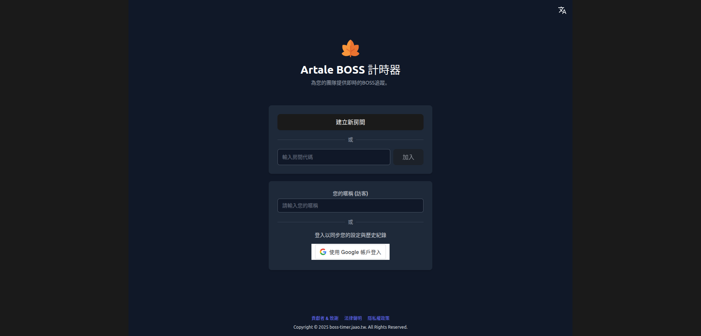

# Artale BOSS Timer

一個為楓之谷世界 (Artale) 設計的即時 Boss 計時器，幫助玩家和團隊高效追蹤 Boss 的重生狀態。

[🔗 Live Demo](https://boss-timer.jaao.tw/) ｜ [📖 使用教學](https://boss-timer.jaao.tw/guide)



---

## ✨ 主要功能

- **即時狀態追蹤** — 卡片總覽或甘特時間軸兩種視角查看 Boss 重生狀態
- **多人協作房間** — 建立獨立房間，房間內所有成員即時同步
- **WebSocket 即時更新** — 狀態變更透過 WebSocket 立即廣播到所有連線成員
- **可拖曳自訂版面** — 拖曳調整區塊順序、1/4 至全寬四段寬度調整、Widget 收合/展開
- **Discord Webhook** — 擊殺即時通知 + 重生前 5 分鐘預警排程，可設定通知事件與預警模式
- **歷史紀錄瀏覽** — 完整 audit log，支援日期區間 (最長 30 天) 與 Boss 篩選、無限滾動載入；可撤銷誤判紀錄
- **自訂 Boss** — 新增房間專屬非標準 Boss，設定名稱與重生時間範圍
- **Boss 收藏** — 標記常用 Boss，下拉選單優先顯示收藏清單
- **Google 帳號登入 / 訪客模式** — 支援 Google OAuth 與匿名快速加入，偏好設定跨裝置同步
- **通知與音效提醒** — 瀏覽器推播通知 + Web Audio API 音效（支援多種音色）
- **深色模式 / 多國語言** — 支援繁體中文與英文

---

## 🛠️ 技術棧

| 類別 | 技術 |
| :--- | :--- |
| **後端** | Python 3.11+, FastAPI, SQLAlchemy, PostgreSQL |
| **即時通訊** | WebSocket (原生 FastAPI) |
| **非同步任務** | Celery + Redis |
| **前端** | Vue 3 (Composition API), Vite, Pinia, TypeScript, Tailwind CSS v4, Element Plus, ECharts |
| **部署** | Docker, Docker Compose, Nginx |
| **套件管理** | uv (Python), npm (Node) |

---

## 🚀 本地開發

### 前置需求

- [Docker](https://www.docker.com/) & Docker Compose
- [uv](https://github.com/astral-sh/uv) — Python 套件管理
- Node.js 18+, npm

### 第 1 步：設定後端環境變數

```bash
cp app/.env.example app/.env
```

編輯 `app/.env`，填入以下必要設定：

```dotenv
# 資料庫連線（本機開發指向 localhost）
DB_HOST=localhost
DB_PORT=5432
DB_USER=your_user
DB_PASSWORD=your_password
DB_NAME=boss_tracker

# JWT 金鑰（可用 openssl rand -hex 32 產生）
SECRET_KEY=your_super_secret_key

# Google OAuth
GOOGLE_CLIENT_ID=your_client_id.apps.googleusercontent.com
GOOGLE_CLIENT_SECRET=your_client_secret
```

> **前端**已內建 `.env.development`，開發時不需另行設定。

### 第 2 步：建立資料庫並執行 Migration

> 本機開發時需要自行準備 PostgreSQL 實例，確保連線設定與 `app/.env` 相符後執行：

```bash
# 在專案根目錄執行（不是 app/ 裡面）
uv run alembic upgrade head
```

### 第 3 步：啟動所有服務

開發時需要同時開啟 **4 個終端機**：

**終端機 1 — Redis（Docker）**
```bash
docker compose -f docker-compose.dev.yaml up -d
```

**終端機 2 — FastAPI 後端**
```bash
uv run uvicorn app.main:app \
  --host 0.0.0.0 \
  --port 1254 \
  --ssl-keyfile=frontend/vite-key.pem \
  --ssl-certfile=frontend/vite.pem \
  --reload
```

> SSL 憑證用於與前端 HTTPS 開發伺服器配合。若尚未產生，可用以下指令：
> ```bash
> cd frontend && npx vite-plugin-mkcert
> ```

**終端機 3 — Celery Worker（Discord Webhook 任務）**
```bash
uv run celery -A app.celery_app worker \
  -Q celery,discord_queue \
  --concurrency=2 \
  --loglevel=info
```

**終端機 4 — 前端 Vite 開發伺服器**
```bash
cd frontend
npm install   # 首次執行
npm run dev
```

開啟瀏覽器前往 `https://localhost:5173`。

---

## 🐳 本機完整容器化（docker-compose.local.yaml）

不想在本機安裝 Python / Node 環境時，可用此方式一鍵啟動完整服務（後端、前端 Nginx、Redis、Celery Workers），資料庫連線沿用 `app/.env` 的設定，指向已有的 PostgreSQL 實例。

```bash
docker compose -f docker-compose.local.yaml --env-file ./app/.env up --build
```

| 服務 | Port | 說明 |
| :--- | :--- | :--- |
| `boss_service` | 1254 | FastAPI 後端 |
| `boss_timer_nginx` | 2255 | 前端 Nginx |
| `redis` | 6381 | Redis（Celery Broker） |
| `celery_worker_fast` | — | 一般任務 Worker |
| `celery_worker_discord` | — | Discord 推播 Worker |

> 若資料庫跑在宿主機，`app/.env` 的 `DB_HOST` 請設為 `host.docker.internal`（而非 `localhost`）。

---

## 🏗️ Docker 建置與部署

### 建置映像並推送

```bash
# 設定版本號
export REMOTE_REGISTRY_IP=harbor.jaao.tw
export BACKEND_VERSION=2.6.0
export FRONTEND_VERSION=2.6.0

docker compose build
docker push ${REMOTE_REGISTRY_IP}/boss_service/boss_service:${BACKEND_VERSION}
docker push ${REMOTE_REGISTRY_IP}/boss_service/boss_timer_nginx:${FRONTEND_VERSION}
```

### 在正式機啟動

```bash
docker compose -f docker-compose.prod.yaml up -d
```

### 正式機執行 DB Migration

```bash
docker compose -f docker-compose.prod.yaml exec boss_service alembic upgrade head
```

---

## 📁 專案結構

```
boss-timing/
├── app/                        # FastAPI 後端
│   ├── database/               # ORM 模型 & 資料庫連線
│   ├── routers/                # API 路由 (auth / rooms / bosses / websocket / system)
│   ├── schemas/                # Pydantic 資料模型
│   ├── services/               # 業務邏輯
│   ├── tasks/                  # Celery 非同步任務 (Discord Webhook、房間清理)
│   ├── websocket/              # WebSocket ConnectionManager
│   ├── celery_app.py           # Celery 設定
│   ├── main.py                 # 應用程式進入點
│   └── Dockerfile
│
├── frontend/                   # Vue 3 前端
│   ├── src/
│   │   ├── components/         # Vue 元件（boss / channel / layout / record / settings / ui）
│   │   ├── composables/        # Composables（useLayoutConfig, useSettings, useBossAlerts…）
│   │   ├── stores/             # Pinia 狀態（user / room / boss / websocket）
│   │   ├── views/              # 頁面視圖（BossTracker, RoomSelection, UserGuide…）
│   │   ├── locales/            # i18n 翻譯（zh / en）
│   │   └── main.ts
│   ├── .env.development        # 開發環境變數
│   ├── .env.production         # 正式環境變數
│   └── Dockerfile
│
├── alembic/                    # DB Migration 腳本
├── docker-compose.yaml         # 建置用（含 build 指令）
├── docker-compose.dev.yaml     # 開發用（只啟動 Redis）
├── docker-compose.local.yaml   # 本機容器化（後端+前端+Redis，DB 連外部）
├── docker-compose.prod.yaml    # 正式環境（全容器化）
├── pyproject.toml              # Python 套件定義 (uv)
└── uv.lock
```

---

## 📄 授權

本專案採用 [MIT License](LICENSE)。